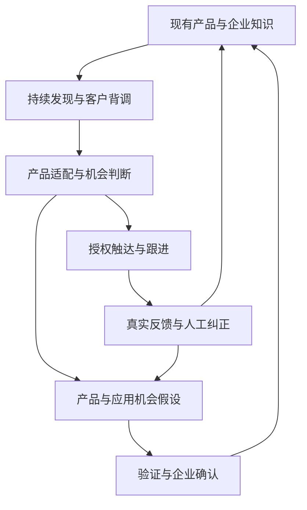

# 织见持续售前增长产品需求文档

版本 v0.1　日期 2026年9月17日　适用对象 产品 设计 研发 试点交付团队

本次改版将织见定义为面料企业的持续售前运营系统。系统以企业现有产品和已确认能力为基础，持续发现并背调潜在客户，在授权范围内推进触达，从反馈中发现销售机会、产品应用机会和产品改进空间，逐步积累可供员工与 Agent 复用的企业知识。

## 01 产品决策与范围

**本版核心决策：取消每轮创建开发任务的产品入口。** 企业首次接入资料并确认经营范围后，系统根据新增产品、客户回复、资料更新和定期检查自动推进工作。人员主要处理事实确认、需要判断的机会和销售交接。系统内部仍保留可追踪的工作项，方便恢复、查错和统计。

沿用已有讨论的范围：首先服务柯桥面料经营企业的售前环节；企业客户背调是核心能力；沿用企业已有 ERP 与 CRM；通过正常业务活动沉淀公司数据和知识。售中、售后及组织架构全面改造暂不进入本版。

**用户已确定的方向：** 现有产品驱动持续开发，AI 主动发现机会，触达反馈形成循环，知识由公司共享。**本文提出的实现建议：** 页面结构、默认运行策略、数据字段、分期方式与验收样例；这些是开发与试点的讨论基线。

### 服务对象与职责

| 角色 | 使用目的 | 主要动作 |
| --- | --- | --- |
| 外贸或业务负责人 | 判断是否带来有效售前产出 | 确认经营范围、触达权限、资源上限和交接标准 |
| 业务员 | 获得可继续跟进的客户和依据 | 纠正背调、处理回复、接受或退回交接 |
| 产品或资料负责人 | 保证对外产品信息可信 | 确认关键字段、判断产品机会、维护适用条件 |
| 系统管理员 | 维持现有系统之间的连接 | 管理数据来源、权限、同步异常与恢复 |

本版产出包括客户背调、产品适配判断、开发材料、触达记录、明确需求的交接和产品机会建议。报价承诺、实际寄样、采购开发、排产、合同与履约不属于本版执行范围。

### 购买理由的待验证假设

企业可能为“产品资料与客户信息结合后，能持续完成更好的售前工作”付费。现有 CRM 的 AI 功能也可能覆盖这些任务；是否形成增量价值，需要与客户现有系统经过合理配置后的结果比较。客户背调和知识库本身不被预设为独有优势。

<!-- pagebreak -->

## 02 持续运行机制

### 首次使用

系统读取产品表、产品资料和可用的 CRM 信息，生成企业经营画像及可开发产品清单。用户确认关键事实、经营边界和权限后，系统持续运行；无需设置任务名称、逐轮下达目标或每次点击开始。

经营画像包含主营品类、已知市场、排除范围、客户归属、可用渠道、负责人和资源上限。AI 可以提出画像建议，并展示依据。信息不足时先研究和补充资料；不得自行扩张对外触达的授权范围。长期偏好支持随时修改，不要求企业为每轮研究重新配置。

### 两个相互连接的循环

销售循环持续寻找当前产品适合的客户。机会循环汇总未满足的需求、新用途和产品条件缺口；经过验证与确认的内容才能更新经营知识或可销售能力。

### FR01 自动调度

| 触发事件 | 系统自动动作 | 结束或等待条件 |
| --- | --- | --- |
| 产品新增或关键字段更新 | 重新筛选相关客户，复核受影响材料 | 关键事实冲突则等待确认 |
| 周期性检查到期 | 更新到期背调，研究新候选客户 | 达到额度或没有新证据则结束本轮 |
| 新客户回复 | 停止该会话原有自动跟进，提取需求与下一步 | 需要销售判断则交给负责人 |
| 获得新的外部信号 | 核查来源，更新相关机会假设 | 无足够依据则保留为观察 |
| 人工确认或纠正 | 更新相应事实版本，重算直接依赖的判断 | 无关客户与材料保持原状态 |

运行状态统一为“研究中、等待新信息、需要确认、达到额度、已暂停、连接异常”。每个状态说明原因和恢复方式。没有机会时可以安静等待，不生成虚假进展，也不强行凑数。

<!-- pagebreak -->

## 03 页面改版与首页

### 导航调整

| 现有页面 | 改版处理 | 核心变化 |
| --- | --- | --- |
| 指挥台与经营总览 | 合并为持续运营首页 | 默认展示系统持续运行状态、机会和待处理事项 |
| 托管开发与任务创建 | 移除手动创建入口 | 工作项由事件和策略自动产生 |
| 客户与项目及已有客户开发 | 合并为客户与机会 | 新老客户沿用同一档案、负责人和关系 |
| Context 融合 | 改为机会与依据 | 展示产品、客户证据、判断和行动之间的关系 |
| 面料库与企业知识 | 合并为产品与知识 | 展示已确认事实、来源、冲突和历史版本 |
| 需求雷达 | 改为产品机会 | 分开显示应用方向、产品改进假设和验证记录 |
| 工作交付与决策台 | 嵌入相关客户与机会 | 按负责人集中显示需要处理的事项 |
| 数据接入 | 保留为连接与运行设置 | 管理数据、经营边界、渠道和运行权限 |

品牌展厅、报价、寄样和采购执行退出首版主导航。现有深链接应跳转到相应的新页面，不出现空白页；旧任务记录可以只读保留。

### 首页结构

页面顶部显示“织见正在基于已确认的产品持续研究客户”，并列出最近一次资料更新、当前运行状态和暂停按钮。经营设置放在次级入口。

首页主体依次展示：需要销售处理的明确需求；值得查看的潜在客户；新增产品机会；需要确认的事实。每张卡片说明“发生了什么、为什么值得看、依据在哪里、下一步是什么”。

统计区区分已研究企业、销售认可目标客户、有效回复和已接受交接。只有真实发生或明确标记为模拟的事件才计数；动画和文本生成不增加业务指标。

### 必须具备的页面状态

- 首次无数据：提示接入产品资料，并说明最少需要哪些字段。
- 资料不足：显示具体缺失项及影响，允许研究继续，受影响的对外动作等待。
- 暂无机会：显示最近检查范围及后续检查时间，不伪造推荐。
- 有结果：点击机会进入证据与行动详情，跨页共享同一状态。
- 连接异常或达到额度：显示原因、受影响范围和恢复入口。

首页不要求用户为系统的每轮工作写 Prompt。人员可以补充经营偏好、纠正判断、暂停某类产品或某个客户。

<!-- pagebreak -->

## 04 产品理解与客户背调

### FR02 产品与企业能力接入

首版支持结构化产品导出表，以及附有明确文本内容的产品资料。文件只能上传但尚不能解析时，应显示“已接收，待解析”，不得显示知识已经更新。PDF、图片和其他格式按实际解析能力逐步增加。

产品至少记录企业料号、品类、已知成分、用途和来源。克重、幅宽、工艺、颜色、起订量、认证等按资料逐项记录；未知保持为空。起订量必须保留单位和适用条件，例如每色、每款、现货或定染。图片和营销描述不能单独证明成分、性能或认证。

系统区分“可用于研究”和“可用于对外表述”。关键参数有冲突时暂停相关产品表述，其他已确认信息仍可用于研究。确认后生成新版本并复核依赖该事实的判断。

### FR03 企业客户背调

客户可以来自系统发现、企业已有 CRM 或人员补充。背调自动补齐研究内容，不要求人员再次创建背调任务。OKKI AiReach 的客户背调、历史记录整合和个性化触达能力进入功能对标范围。[OKKI AiReach 官方说明](https://www.xiaoman.cn/products/ai_reach.html)

| 背调维度 | 输出要求 |
| --- | --- |
| 企业身份 | 名称、官网、地区、业务类型及身份匹配依据 |
| 产品与市场 | 经营品类、已观察到的用途、销售渠道和市场定位 |
| 采购关系 | 品牌、成衣厂、贸易商或其他角色；谁选料、谁采购仍未知时明确标记 |
| 联系方式 | 来源、职位或角色、核验状态，不补造联系人 |
| 历史关系 | 原 CRM 编号、负责人、沟通、拒绝原因与已有项目 |
| 时机与限制 | 新品等公开信号、明确需求、排除条件和信息缺口 |

背调结果分为“已核验事实、可追溯观察、AI 推断、待确认事项”。每条关键结论附原始来源、采集时间和适用范围。页面不可访问、身份重名或证据不足时给出不完整结果，不虚构完整报告。

去重先使用 CRM 标识、企业域名和已确认身份关系。多个品牌、母子公司及采购实体不得仅因名称相似而自动合并；不确定时交给人员确认。

客户档案持续更新，保存版本和变化。客户的单个项目要求关联该项目及时间；升级为长期偏好需要额外依据。

<!-- pagebreak -->

## 05 匹配判断与持续触达

### FR04 产品与客户匹配

匹配同时检查产品条件、客户用途、采购关系、企业经营范围和历史关系。输出“建议联系、需要补充信息、当前不适合”及原因。硬性不匹配不能被其他维度的高分抵消；页面不以一个没有解释的百分比分数代替判断。

公开信息中的“推出亚麻服装”只支持潜在适配。只有可追溯的客户表达才能记录为明确需求。采购身份未知时，下一步可以是核实采购方式，不得把品牌自动当作直接买布客户。

每份判断保存使用的产品版本、证据、尚未满足的条件和有效状态。产品下架、要求变化或证据过期后，只重算依赖相关内容的判断与草稿。

### FR05 触达与跟进

系统根据匹配结果、客户历史和已确认产品事实准备开发内容。首版优先覆盖邮件；其他渠道只做接口预留。内容应说明联系理由、可提供的相关产品，以及一个值得确认的问题。未经确认的价格、交期、认证与产能不得作为承诺写入。

用户可选择“审核后发送”或对特定产品、市场、渠道启用“授权范围内自动发送”。资料准备和内部研究可以持续自动运行；外部发送必须具备相应企业授权。新市场、新用途和变化后的关键事实若超出现有范围，等待相应确认。

发送前统一检查：产品与草稿版本、联系人可用性、CRM 负责人、正在进行的沟通、重复触达、拒收状态、频次和额度。同一企业不同联系人也纳入频次控制。初次未确认的采购角色，只能使用用于核实角色的内容。

### 跟进终止与恢复

- 收到回复：立即停止该会话原有自动跟进，先识别回复类型与下一步。
- 收到明确拒绝或拒收：停止对应范围的开发，保留抑制记录；AI 不自行解除。
- 无回复：到达允许的跟进次数后进入等待，不将沉默解释为没有需求。
- 产品关键字段变化：尚未发送的相关草稿失效；已经发送的内容保留记录，由负责人判断是否需要更正。
- 发送或回写结果未知：先核对渠道实际状态，不盲目重试产生重复消息。

销售接管客户后，默认暂停相关自动触达。负责人明确开放某个范围后，系统才能继续协作。

<!-- pagebreak -->

## 06 反馈理解与产品机会

### FR06 回复处理与销售交接

回复分类至少包括：明确需求、转介采购方、提出问题、当前不合适、明确拒绝、自动回复和无法判断。自动回复不计为有效销售回复；分类不确定时进入人工确认。

明确需求记录客户原文、涉及产品或参数、适用项目、时间、采购角色和未解决事项。触达渠道的事件时间与回复时间保留，便于还原真实沟通顺序。

交接材料包括企业背调、当前联系人及角色、需求证据、产品匹配、已发生的沟通、未确认条件和下一步建议。业务员可以接受或退回并填写原因。只有接受后的交接计入已接受交接量；该状态不等于成交。

### FR07 三类机会

| 类型 | 典型发现 | 推进方式 |
| --- | --- | --- |
| 现有产品销售机会 | 已确认产品可能适合某个客户 | 完成背调与验证，推进触达或交接 |
| 产品应用机会 | 同一产品可能适合新的客群、用途或市场 | 建立假设，在经营授权内开展有限验证 |
| 产品改进机会 | 多个项目反映成分、规格、资料或交易条件缺口 | 汇总证据，提交产品负责人判断 |

产品改进包括资料表达和选料体验的改善，也包括需要企业另行评估的产品参数与交易条件变化。建议必须说明属于哪一类，避免把所有问题都归为“开发新面料”。

### 机会卡的必填内容

机会描述、关联现有产品、需求与观察的证据、去重后的独立客户或项目数、反面证据、当前未知项、建议验证方式、负责人和状态。缺乏价格、成本或采购量依据时，不展示虚构的订单金额或收入预测。

产品机会状态为“待验证、验证中、已支持、未支持、暂缓”。一次客户提问可以生成待验证假设；不能直接成为市场趋势。同一消息的多次转述、同一集团的重复记录应关联去重，不重复计为独立需求。

系统可提出验证问题、补充研究并归集回答。跨市场实验、对外调研发送和新的产品承诺遵循既有权限。负责人接受某项建议不代表能力已具备；只有实际确认后的产品条件，才进入可对外使用的产品版本。

<!-- pagebreak -->

## 07 企业知识与 Context 融合

### FR08 共享知识的形成

知识由原始资料、结构化事实、业务判断和行动结果组成。原始资料保留证据；结构化事实记录公司共同使用的信息；业务判断保留适用范围和依据；行动结果用于改进后续推荐。

每条关键记录具有来源、时间、范围、负责人员、确认状态和版本。员工修正背调或退回交接时，在当前工作界面记录原因，避免另外维护一套无人使用的知识库。

AI 产生的总结、评分和推断不能仅通过互相引用升级为事实。外部网页或邮件中的指令属于待分析内容，不得改变系统权限或触发越权动作。未验证的推断默认不能支撑产品能力承诺。

### FR09 改造 fusion 页面

保留现有“信息变化影响相关工作”的交互，默认展示一个机会的依据。页面第一屏包含：当前判断、关联产品、关键客户证据、未确认条件和下一步。

| 页面区域 | 需要显示的内容 |
| --- | --- |
| 企业一侧 | 当前产品与版本、适用条件、能力范围、历史经验 |
| 客户与市场一侧 | 明确要求、历史沟通、公开观察、各自来源 |
| 判断区域 | 匹配与不匹配条件、缺失信息、判断状态 |
| 行动区域 | 草稿、核实问题、负责人、交接或验证动作 |
| 变化记录 | 哪条证据改变、影响哪些判断、哪些材料已失效 |

关系图作为展开视图保留，节点必须对应实际记录；点击节点可看到来源与版本。页面数字从同一份业务状态计算，不再在卡片、图谱和统计中分别写死。

### 示例更新规则

客户确认当前项目只接受 100% 亚麻后，原混纺产品判断失效，相关未发送草稿进入“需要更新”。系统保留旧版本及失效原因。其他客户不受影响，该客户的其他项目也不自动继承这个限制。

企业有已确认替代产品时可提出新建议；没有时形成需求缺口，进入产品机会队列。系统不自动推断供应商能够生产，也不启动采购或打样。

<!-- pagebreak -->

## 08 ERP CRM 与数据对象

### FR10 既有系统的分工

ERP 中的既有产品标识及企业指定的权威字段继续沿用。CRM 中的客户身份、负责人、已有关系和沟通记录继续沿用。织见补充售前研究、证据关联、匹配判断、运行记录和产品机会，并将约定成果回写 CRM。

字段优先级按企业确认的映射配置，不能把 ERP、邮件或最新文件中的任意一种来源一概视为正确。冲突保存两侧记录并等待确认。首次接入可使用脱敏导出文件；API 能否读取、写回及其费用，在试点时逐个确认。

| 数据对象 | 必要字段与关系 |
| --- | --- |
| ProductVersion | 企业料号、版本、属性、条件、来源、确认状态 |
| Account 与 Contact | 企业身份、CRM 编号、角色、负责人、抑制状态 |
| Evidence | 原始内容引用、时间、访问权限、实体与适用项目 |
| Requirement | 客户表达、产品条件、项目、时间、确认状态 |
| Assessment | 关联产品版本与证据、适配判断、缺口、失效原因 |
| Outreach 与 Feedback | 草稿版本、发送状态、渠道标识、回复与分类 |
| Opportunity | 机会类型、依据、验证状态、负责人和反面证据 |
| Knowledge 与 Policy | 业务规则、适用范围、确认者、策略版本 |
| Event 与 Handoff | 触发原因、处理状态、可恢复记录及销售接收状态 |

所有对象至少携带企业标识、创建与更新时间。业务事实和证据分开保存，删除或失去访问权限的来源不能继续被未经授权的人员或 Agent 读取。

### 回写与恢复

客户编号已存在时更新关联记录，不重复创建客户或修改归属。回写内容及范围可配置，回写失败显示“待同步”；重复执行同一动作不得产生第二条发送记录或重复商机。

CRM 信息与本地判断冲突时保留原记录并提示处理。系统离线、凭证失效或资料过期时，依赖实时有效信息的发送暂停，允许不受影响的内部研究继续。

没有 CRM 的企业可导出交接材料并保存轻量客户档案。首版不扩大为完整 CRM，也不强制客户迁移既有主数据。

<!-- pagebreak -->

## 09 自主运行边界与异常处理

### FR11 授权模式

| 动作 | 默认运行方式 | 超出范围时 |
| --- | --- | --- |
| 背调和公开信息研究 | 在已允许的数据源及额度内自动运行 | 等待补充权限或下次额度 |
| 匹配、草稿与机会假设 | 自动生成，标记证据和未确认项 | 资料冲突时暂停相关输出 |
| 首次触达及跟进 | 审核后发送，或按企业预先授权自动发送 | 等待负责人确认 |
| 企业关键事实和经营范围变更 | 由指定人员确认 | 不以模型推断直接覆盖 |
| 产品开发、价格与履约承诺 | 交给企业现有人员与流程 | 不自动执行 |

企业可暂停全局、某个渠道、某个产品或某个客户。暂停应停止尚未执行的外部动作；已经发送的消息保留事实记录。恢复时重新检查资料、授权、频次与当前客户状态。

### FR12 运行可靠性

- 调度事件带唯一标识。重复导入、重复回调及刷新页面不产生重复发送、重复交接和重复业务计数。
- 多人同时操作时检查记录版本。审批后资料变化，旧审批不再覆盖已经变化的内容。
- 发送前再次读取最新产品状态和客户抑制状态，避免队列中的旧动作继续执行。
- 模型或数据服务失败时显示原因并有限重试；无法判断的动作转为待处理，禁止伪造成功。
- 每次对外动作可追溯至内容版本、相关事实、授权和渠道结果；只有渠道确认后才标记为已发送。
- 按企业和角色隔离资料。Agent 沿用对应身份的访问范围，不因汇总知识而扩大权限。

### 建议的首版运行设置

企业只需确认可开发产品、经营范围、负责人、触达方式和研究及发送上限。跟进间隔、到期复核周期可以给出可修改的默认值。数值由试点团队根据渠道和业务情况确认，不在本 PRD 中预设为行业最佳值。

系统根据缺口、信息新鲜度和潜在适配性安排研究顺序。保留少量对相邻用途的研究空间，避免只重复寻找与历史客户完全相同的企业；相邻方向的对外触达仍受经营授权约束。

<!-- pagebreak -->

## 10 Demo 演示脚本

### 演示数据与运行方式

沿用禾序纺织、HX-L240、Lund 与 Seabrook 等演示名称。客户、资料、回复和业务数量统一标注为演示数据。设定 HX-L240 的演示成分为亚麻 55%、棉 45%，各页面使用同一记录；真实试点以企业确认资料为准。

Demo 默认载入一个已经完成首次配置的企业。打开首页即看到持续运行状态与已有结果。可提供“模拟收到回复”和“模拟资料更新”用于展示事件，按钮只出现在演示控制区，不成为真实产品中创建开发任务的替代入口。

### 场景一 持续发现与销售交接

1. 系统读取已确认产品和已有客户范围，自动出现候选客户。
2. 打开 Seabrook，查看业务、采购角色、公开信号、历史关系和信息缺口。
3. 查看推荐 HX-L240 的依据，明确公开系列信息尚不能证明采购需求。
4. 生成基于已确认事实的介绍材料，审核后模拟发送；统计显示模拟发送。
5. 模拟客户回复明确产品需求，系统停止旧跟进并形成交接材料。
6. 业务员接受交接，客户状态和全局指标更新，研究结论与反馈进入共享知识。

### 场景二 客户要求改变

Lund 当前项目新增“只接受 100% 亚麻”的明确回复。系统更新项目要求、使原混纺推荐与未发送草稿失效，并记录原因。其他客户不变化。没有确认的替代产品时，生成待验证的纯麻需求缺口。

从 fusion 深链接直接进入也可演示这一过程，不依赖其他页面先完成隐藏步骤。刷新后仍保留一致状态；重置演示恢复同一组初始数据。

### 场景三 产品机会返回知识库

演示中加入来自另一个独立客户项目的相似需求，系统关联为同一产品机会，显示独立证据数量和未知成本条件。产品负责人可选择验证、暂缓或否决，并记录理由。

随后模拟负责人确认企业已有另一款符合要求的现货产品。只有确认完成后，新产品版本才进入可开发清单，并自动复核先前受阻的客户；被拒收或已由销售接管的客户仍不自动触达。

### 演示与真实能力的界限

首版允许模拟调度、渠道发送、客户回复和 CRM 回写，但交互状态与依赖更新必须真实一致。页面分别标注“演示、模拟发送、待同步、真实已连接”，不能用动画表示已执行真实操作。验证产品闭环后，再接通真实企业与渠道。

<!-- pagebreak -->

## 11 验收标准

以下为 Demo 与后续试点的功能验收，不代表已实现，也不代表承诺的商业效果。

| 编号 | 检查情形 | 通过标准 |
| --- | --- | --- |
| AC01 | 企业完成首次配置 | 无需创建开发任务即可出现自动研究与候选结果 |
| AC02 | 没有新证据或额度用尽 | 进入明确的等待状态，不生成虚假新增成果 |
| AC03 | 背调来源缺失或身份不明 | 显示未知与待确认，不生成无来源的确定结论 |
| AC04 | 客户有公开新品信号 | 仅记录观察，不自动记为明确需求或合格商机 |
| AC05 | 客户已有负责人或重复身份 | 保留原负责人和客户关系，抑制重复建档与触达 |
| AC06 | 企业启用限定自动发送 | 仅在授权范围内执行，记录内容与授权版本 |
| AC07 | 收到回复或拒收 | 旧跟进立即停止，分类不确定时转人工 |
| AC08 | 客户当前项目要求纯麻 | 原混纺判断及相关草稿失效，无关记录不变 |
| AC09 | 产品关键事实存在冲突 | 阻止受影响的对外表述，确认后再生成新版本 |
| AC10 | 只有一条弱信号 | 可以生成假设，不能写成已确认市场需求或企业能力 |
| AC11 | 重复事件与页面刷新 | 不重复发送、交接、建档或累计指标 |
| AC12 | CRM 同步失败 | 显示待同步，可核对后重试，不虚报写回成功 |
| AC13 | 新产品能力得到确认 | 相关受阻机会重新评估，拒收与接管规则仍生效 |
| AC14 | fusion 直接打开与演示重置 | 场景可独立运行，页面、图谱、草稿与统计状态一致 |
| AC15 | 两位成员处理同一记录 | 真实试点中可见一致版本，冲突可识别、动作可追溯 |
| AC16 | 不同企业或无权角色访问 | 无法读取越权资料及其派生上下文 |

首版 Demo 重点覆盖 AC01 至 AC14。AC15 与 AC16 在接入真实企业数据和多人使用前必须通过；纯浏览器本地存储的演示不能被作为多人协作能力的证明。

演示之外的发送、幂等、失效传播、企业隔离和权限变化，应使用可重复的验证用例。页面文案、颜色等低影响调整无需另建与实现重复的测试。

<!-- pagebreak -->

## 12 商业验证与成功指标

### 比较对象

试点比较“织见加企业现有系统”与“企业现有系统经过合理配置后的工作方式”。记录双方数据范围、客户样本、时间预算、人工审核和第三方工具费用。具有条件时分组或分阶段比较，避免将名单差异或季节变化直接解释为产品效果。

### 主要指标

| 指标 | 定义与用途 |
| --- | --- |
| 销售认可目标客户率 | 按双方约定标准被接受的目标企业数除以已评审企业数；同时展示两个原始数量 |
| 单个合格目标客户处理时间 | 研究、审核、纠错和必要维护的总时间除以认可客户数 |
| 有效回复率 | 去除自动回复后有业务意义的回复数除以成功送达的首次触达对象数，口径固定 |
| 已接受交接量 | 有明确需求证据且被业务员接收的交接数；与一般目标客户分开 |
| 错误与重复率 | 无依据产品表述、重复触达、错误归属等按类型统计 |
| 产品机会验证结果 | 假设被支持、未支持与暂缓的数量及对应证据，避免只统计建议数量 |

成交和收入作为后续跟踪指标，保留来源与参与范围。短期试点不承诺因果意义上的收入增长，也不把潜在采购量折算为已实现价值。

### 收费与持续价值

商业形态建议为有范围的接入与流程实施，加持续研究、运行维护与质量改进服务。一次性资料整理对应一次性交付；持续收费需要有持续产出和可见的运行责任。此处不预设未经验证的市场价格。

试点必须记录交付工时、人工审核、模型与数据服务、连接维护和客户支持成本。即使售前效果改善，若每家企业都需要高强度重新开发，也应按项目服务评估盈利，不预设已经形成可规模化的软件产品。

### 继续投入的条件

企业愿意提供可用资料并指定业务负责人；团队实际使用研究和交接结果；相对现有办法出现可复现的质量或效率改善；客户愿意续费或扩大使用；重复交付时人工成本可控。各项量化阈值由试点双方在开始前约定。

<!-- pagebreak -->

## 13 开发分期与协作上下文

### 分期范围

| 阶段 | 交付范围 | 进入下一阶段的依据 |
| --- | --- | --- |
| P0 可交互 Demo | 持续运行首页、背调、匹配、模拟触达反馈、产品机会、共享状态与变化传播 | 演示脚本完整且 AC01 至 AC14 通过 |
| P1 单企业真实试点 | 有持久化的多人数据、一个真实资料入口、一个邮件渠道、一个 CRM 接入或明确的人工回写流程 | 权限与可靠性通过验证，业务指标可测量 |
| P2 重复交付 | 可复用字段映射、运行配置、连接适配、产品机会验证与成本管理 | 多家企业出现同类需求且实施成本可接受 |

P0 的数据、事件与页面分离组织，模拟事件与后续真实连接复用业务接口。无需先建设全供应链数据平台。工期在拿到源项目、确认人员与接入条件后估算，本 PRD 不把未知条件写成固定交付承诺。

### GitHub 协作建议

仓库保存可维护源码、脱敏演示数据和项目共识。README 说明运行方式与当前能力；docs/product-context.md 保存已确定方向；docs/prd.md 维护本需求；docs/decisions 记录决策变更；docs/sources 记录研究依据；src 存放业务状态和页面；fixtures 存放演示数据；tests 覆盖关键业务规则。

项目上下文与客户业务数据分开管理。客户原始邮件、联系人、账户凭证及生产数据库不进入公共仓库。真实企业的知识在权限控制的数据环境中维护；代码仓库只保留结构、接口与脱敏案例。

PR 需要说明影响哪些需求与业务规则。改变匹配、授权或知识更新方式时同步更新文档与相关验证用例。模型与连接服务可更换，企业事实、证据标识和业务状态保持可迁移。

### 决策记录与待验证项

本版记录的方向变更为：取消逐轮人工创建开发任务；保留首次经营配置；将客户背调列为核心能力；增加应用与产品改进机会循环；明确 ERP 与 CRM 的原有职责；限定在售前。

试点前需确认首家企业的产品资料质量、实际采购链条、现有 CRM 的能力、可用数据接口、联系人来源、触达渠道及内部负责人。尚未验证的核心假设是行业匹配质量、人员采用程度、持续付费意愿和交付成本。这些不阻塞 Demo 制作，但决定真实试点的范围。

### 参考资料

现有产品与改版对象：[织见 Weave Demo](https://0xrelander.github.io/weave-demo/#/fusion)。

功能对标：[OKKI AiReach 官方产品说明](https://www.xiaoman.cn/products/ai_reach.html)。官方说明包含企业与联系人核验、客户背调、历史资料整合及触达；这些是厂商披露的能力，本文未将其宣传成果视为纺织场景的已验证效果。

产品边界、商业问题与本版方向来自本项目讨论。本文将待验证假设保留为假设，便于后续试点修正。
